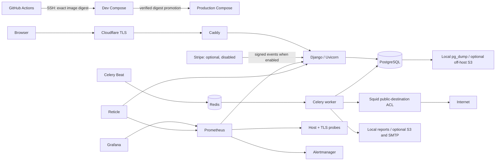

# UptimeKit

A small Django SaaS operated as a public infrastructure-ownership reference.
Customers get scheduled HTTP checks, durable incidents and weekly exports;
operators get SSH releases, Prometheus/Grafana, evaluated alerts, recovery workflows,
and a live read-only Reticle topology.

**Live:** https://uptimekit.masoftware.net/infrastructure/

**Deployment evidence and current limitations:** [deployment report](docs/deployment-report.md).
This is a single-host reference, not an HA platform or an advertised SLA.



## Workflows

| Workflow | Outcome |
|---|---|
| Test, build and deploy dev | PostgreSQL tests, deployment checks, immutable ARM64 image, real runtime smoke |
| Promote verified image to production | Same digest, pre-release backup, migrations, web/worker/Beat update, fresh canary |
| Operate and recover | Status, smoke, rollback, restart, backup, disposable restore, controlled dev failure drills |
| Bad release rollback drill | CI-built failure image must be rejected and automatically rolled back in dev |
| Independent public health check | Best-effort external HTTPS probe from GitHub, outside EC2's failure domain |

The workflow YAML is thin glue. `scripts/remote.sh` uses ordinary SSH and a git
archive; the remote scripts use Compose, curl, pg_dump, pg_restore and the AWS CLI.
These scripts also work from a terminal or Gitea Actions.

## Local development

Python 3.14, Docker Compose, PostgreSQL 17 and Redis 7 are required.

```sh
python3 -m venv .venv
.venv/bin/pip install -r requirements.lock
docker compose -f compose.dev.yaml up -d
export DJANGO_DEBUG=true POSTGRES_PASSWORD=uptimekit
.venv/bin/python manage.py migrate
.venv/bin/python manage.py runserver
# Separate terminals, with the same environment:
.venv/bin/celery -A config worker -l INFO --concurrency=1
.venv/bin/celery -A config beat -l INFO
.venv/bin/python manage.py collectstatic --noinput
.venv/bin/python manage.py test tests
```

Register at `/accounts/signup/`, log in, and add monitors for free. With the default
`BILLING_ENABLED=false`, monitor creation, scheduled checks and reports require no
Stripe subscription. Tenant isolation still applies. Stripe remains available as
an opt-in: configure its credentials and set `BILLING_ENABLED=true` to require
active subscriptions across the UI and background work.

`seed_canary` creates a separate operator-owned synthetic workspace with **no user
membership**. Email is disabled. On-host PostgreSQL backups run daily and before
releases, with seven-day local retention and a tested restore workflow. Off-host
storage and its alert rule are optional and disabled for this deployment.

## Operator documentation

- [Deployment and secrets](docs/deployment.md)
- [Runbook and recovery](docs/runbook.md)
- [Architecture and correctness boundaries](docs/architecture.md)
- [Deployment report and measured evidence](docs/deployment-report.md)
- [Reticle integration](docs/reticle.md)

The generated PDF in the local working directory is source material, excluded
from the repository. Reticle's private daemon source and binaries are deployed
separately; this repository contains only its integration configuration.
