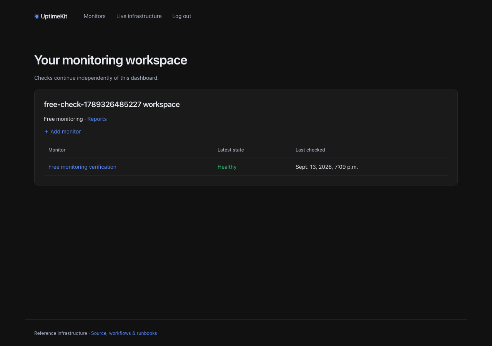
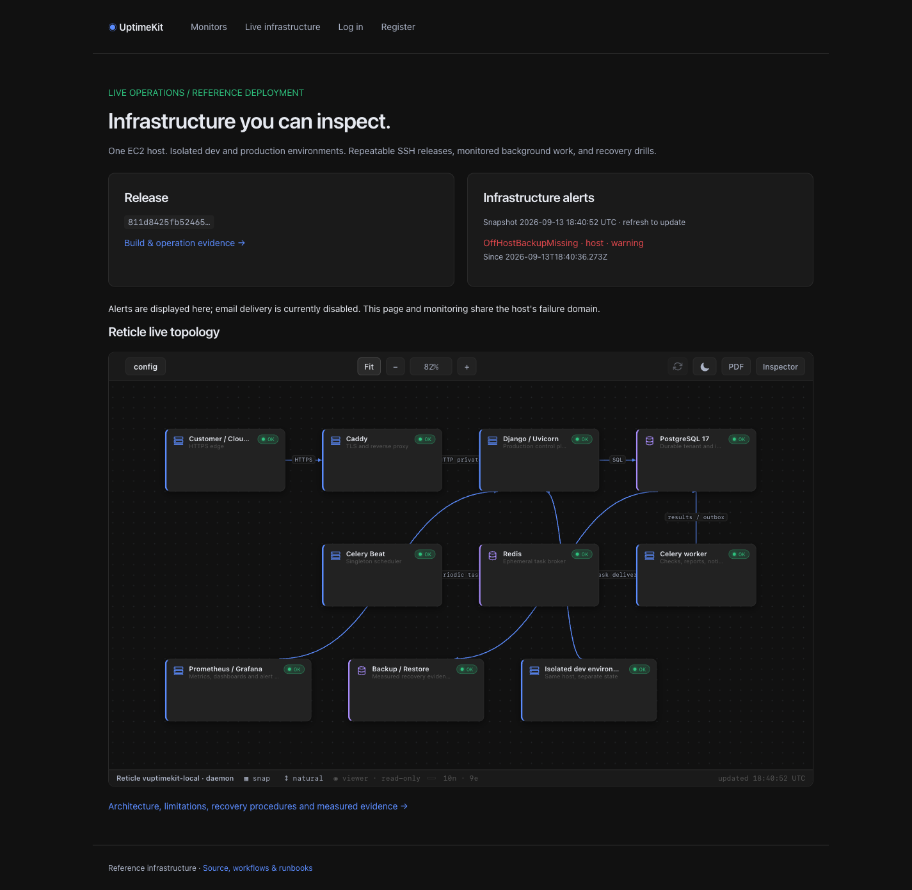
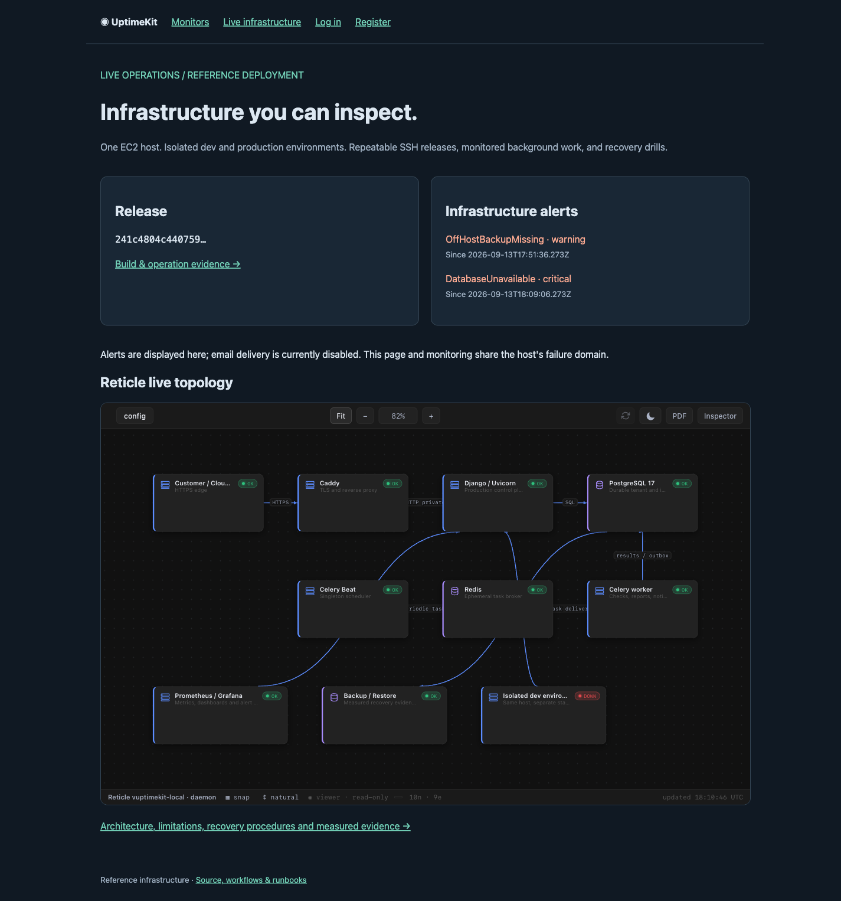

# UptimeKit — deployment and infrastructure ownership report

**Evidence date: 13 September 2026 (UTC).** This is a working single-host reference
deployment with observed releases and failure/recovery drills. Measurements below
describe this small dataset and this host; they are not uptime or recovery SLAs.

## Current operating policy

At the operator's request, monitoring is now **free after login**, with
`BILLING_ENABLED=false` as the default. Stripe integration is retained as an
explicit opt-in for later. The shared access policy covers monitor creation,
dispatch, worker execution, reports and stale-monitor metrics, while preserving
tenant isolation and the actual stored subscription states.

**Backups are on-host for now**: daily and pre-release PostgreSQL dumps, seven-day
retention, and the verified disposable restore workflow. Off-host S3 and its alert
rule are optional; the off-host alert is no longer loaded by default. Existing
backup/restore-freshness alerts remain enabled. The UptimeKit brand links to the
Monitors dashboard.

The free-mode update passed **20 PostgreSQL-backed tests**, including the retained
paid-mode checks and new coverage for free creation/dispatch/execution, reports
without billing records, and disabled Stripe calls even when keys are present:
[CI](https://github.com/mannders00/uptimekit/actions/runs/34776429716),
[production promotion](https://github.com/mannders00/uptimekit/actions/runs/34776635144).
In the live browser, a newly registered user logged out and back in, created a
monitor without subscribing, and received a real scheduled HTTP 200 check (88 ms).
Clicking the UptimeKit brand returned to Monitors. The synthetic monitor, account
and workspace were removed after verification.

Prometheus verification confirmed the off-host alert was not loaded, while local
backup freshness and restore-drill alerts remained enabled; Alertmanager reported
no active alerts after the update.



The release identifiers, measurements and screenshots below record the original
infrastructure exercises; screenshots showing the off-host warning predate this
policy change. The health endpoint always reports the currently running release.

## Public entry points

- Application: https://uptimekit.masoftware.net/
- Infrastructure and evaluated alerts: https://uptimekit.masoftware.net/infrastructure/
- Read-only Reticle diagram: https://uptimekit.masoftware.net/reticle/
- Live release identity/readiness: https://uptimekit.masoftware.net/health/ready
- Source and operational workflows: https://github.com/mannders00/uptimekit

The app is reachable through Cloudflare and Caddy. Caddy obtained a real Let's
Encrypt origin certificate. Registration, login/logout, an authenticated workspace
dashboard, and the unpaid monitor-creation gate were exercised in a real browser.
The synthetic browser-test account was disabled after verification.

Original themed application release used for the screenshots:

```text
commit: 811d8425fb52465c64efa7eabd1356c068011306
image: ghcr.io/mannders00/uptimekit@sha256:8138b791af4b9610bc650ed2919d74b59a7b40e54883f13405f7542aaa346093
```

The website now matches Reticle's deployed charcoal palette, blue accent, status
colors, borders and font stack. Browser verification compared all twelve shared
color tokens and the computed font family; they matched. Both 1440px desktop and
390px mobile layouts were checked for horizontal overflow.



## Existing deployment

| Layer | Deployed implementation |
|---|---|
| Host | EC2 t4g.medium, ARM64 Debian 13, 4 GiB RAM, 40 GB EBS, operator-assigned Elastic IP |
| Dev and prod | Separate Compose projects, PostgreSQL/Redis instances, networks, secrets and media volumes |
| Runtime artifact | One CI-built image for Django/Uvicorn, Celery worker and singleton Beat; digest promotion |
| Application | Django 6.1, custom user, workspace membership, monitor CRUD, checks/incidents and weekly CSV exports |
| Background reliability | PostgreSQL scheduling outbox, idempotent job completion, notification outbox and retention |
| Network checks | Public HTTP(S), no redirects, bounded time, private-destination filtering through Squid |
| Metrics | Prometheus, application metrics, node exporter and blackbox HTTPS/TLS probe |
| Dashboard | Grafana 12.3.3, provisioned eight-panel UptimeKit dashboard; private over SSH |
| Alerts | Prometheus rules → Alertmanager → curated public snapshot with explicit freshness |
| Infrastructure diagram | Go Reticle daemon under systemd; live HTTP/Prometheus collectors, public viewer only |
| Backups | Daily/manual custom-format pg_dump, checksums, seven-day local retention |
| Restore verification | Weekly/manual disposable PostgreSQL restore with Django checks and state validation |
| External health | Scheduled GitHub-hosted HTTPS check, outside the EC2 failure domain |

Customer monitoring is free unless billing is explicitly enabled. An operator-owned canary
workspace has no customer memberships and checks `https://example.com/`; it proves
the asynchronous loop independently of user-created monitors.

At one observed point during verification, the host had approximately **2.4 GB
available memory** and **33 GB available root-disk space**. This is a snapshot,
not a capacity/load-test result. Services have explicit memory limits and bounded
Docker log rotation; Prometheus retains 15 days or 2 GB.

## Release and configuration ownership

GitHub `dev` and `prod` environments contain `SSH_HOST`, `SSH_USER`, `SSH_KEY` and
`SSH_KNOWN_HOSTS`, and accept deployments from `main`. Host trust is pinned;
workflows do not accept arbitrary new SSH host keys. Production is a manual
promotion of the digest recorded as verified in dev.

Runtime credentials live under `/etc/uptimekit/`, release bundles under
`/opt/uptimekit/releases/<commit>/`, and operational state under
`/var/lib/uptimekit/{dev,prod}/`. Workflows upload a git archive and invoke shell
scripts over SSH. The host does not build application images.

Deployments check production settings, migrate, wait for actual web-container
readiness, test egress ACLs, perform an authenticated dashboard smoke, and require
a newly successful scheduler/worker canary. An existing environment is backed up
before migrations. A host-side lock serializes deployment/recovery operations.
Application rollback retains the migrated schema and therefore requires compatible
expand/contract migrations.

## Observed verification and recovery

| Exercise | Observed result | Evidence |
|---|---|---|
| PostgreSQL application tests | 17 tests: tenant boundaries, ownership, paid execution, incident ordering/idempotency, retention, DNS/timeout safety, readiness, signed webhook retries/current-state reconciliation, signup, notification failures, report generation/download isolation | [CI](https://github.com/mannders00/uptimekit/actions/runs/34775085379) |
| First successful dev release | Tested image, migrations and fresh runtime canary passed through SSH | [Run](https://github.com/mannders00/uptimekit/actions/runs/34772359810) |
| Production promotion | The verified image was promoted and public HTTPS readiness passed | [Run](https://github.com/mannders00/uptimekit/actions/runs/34775274708) |
| Real egress checks | Public HTTPS returned 200; metadata/private/loopback HTTP returned 403; private HTTPS CONNECT was denied | `check_egress` output in release logs |
| Production database restore | Fresh isolated database restored and checked in **8 seconds**; source was explicitly **local** | [Run](https://github.com/mannders00/uptimekit/actions/runs/34773625641) |
| Worker stopped in dev | SchedulerStale and MonitoringCanaryStale fired; service restarted and a new successful check was recorded | [Run](https://github.com/mannders00/uptimekit/actions/runs/34772874348) |
| Redis stopped in dev | BrokerUnavailable, SchedulerStale and MonitoringCanaryStale fired; runtime recovered | [Run](https://github.com/mannders00/uptimekit/actions/runs/34773366470) |
| PostgreSQL stopped in dev | Expected DatabaseUnavailable alert asserted; dev returned 503 while prod returned 200; a fresh canary passed after restart | [Run](https://github.com/mannders00/uptimekit/actions/runs/34773624477) |
| Bad web image | Container readiness rejected the CI-built failure artifact; previous image was restarted and runtime verified | [Run](https://github.com/mannders00/uptimekit/actions/runs/34772893893) |
| Manual rollback in dev | Previous artifact restored, runtime checked, and current/verified release records updated | [Run](https://github.com/mannders00/uptimekit/actions/runs/34774204735) |
| Reticle authorization | Real public websocket received `viewer`; `save_config` was refused as requiring editor | Browser verification and local Go websocket regression test |
| Grafana provisioning | Dashboard UID `uptimekit`, eight panels, Grafana database health `ok` | Authenticated loopback API verification |
| Private operator HTTPS | Dev login and production admin login returned 200 using the trusted local CA; distinct environment-specific secure CSRF cookies observed | Loopback TLS verification |

### Measured timelines

- **Worker drill:** started 17:52:09; scheduler alert firing timestamp 17:54:21
  (about 132 seconds); canary alert firing timestamp 17:55:51 (about 222 seconds).
  Restart began at 17:56:12; a fresh canary passed at 17:56:19 (about 7 seconds).
- **Redis drill:** started 18:02:10; broker alert firing timestamp 18:02:51
  (about 41 seconds). Restart began at 18:06:11; runtime passed at 18:06:34
  (about 24 seconds).
- **PostgreSQL drill:** started 18:08:07; database alert firing timestamp 18:09:06
  (about 59 seconds). Restart began at 18:12:07; runtime passed at 18:12:52
  (about 45 seconds).
- **Bad release:** readiness rejected the web container and rollback began at
  17:56:30; restored runtime passed at 17:56:51 (about 21 seconds). Another smoke
  passed at 17:57:38. Total workflow duration includes waiting for another drill's
  lock and is not the rollback duration.
- **Restore:** verified at 18:07:13, duration 8 seconds after the backup/download
  preparation phase. The restored sample had 2 users, 3 workspaces, 2 memberships,
  3 billing accounts, 1 monitor, 36 check results and 0 incidents. It validates a
  small local dump restore, not a full host rebuild or a large customer database.

Alert timestamps above are Alertmanager's firing timestamps. Evaluation, `for`
durations, scheduling and collection intervals all contribute to detection delay.

## Failure evidence in the public diagram

At 18:10 UTC the dev database drill produced HTTP 503 on dev readiness while
production readiness returned HTTP 200. The screenshot captures the actual
DatabaseUnavailable alert and Reticle's red dev node alongside healthy production
nodes. That earlier app release did not yet label the environment in the alert
card; the current UI includes environment labels.



## Reticle integration details

The daemon was built from local Reticle revision
`4d345922087df506e8bf73b72231a8b790c87409` **plus the existing local worktree and a
small bearer-authentication fix**. Its version label is `uptimekit-local`.

Deployed binary SHA-256:

```text
9ce750b6f8560c642ef68c49492519fe4fa620fc95b461f92690c36734bc8e0f
```

The WebSocket handler now honors the same bearer-header precedence as the HTTP
API. A new Go regression test proves a viewer header cannot be elevated by an
editor query parameter. These two changes remain in the local private Reticle
working tree; its private source/binary were not added to this public repository.
Caddy also supplies the measured CSP hash matching the embedded import map.

The daemon has no editor token, custom-command permission, action definitions or
Docker socket. The public interface exposes reader access only. Its configuration
is versioned in `ops/reticle/topology.yaml`; `scripts/install-reticle.sh` makes
installation repeatable. For embedding on `masoftware.net` or `www.masoftware.net`:

```html
<iframe
  src="https://uptimekit.masoftware.net/reticle/"
  title="Live UptimeKit infrastructure"
  style="width:100%; height:720px; border:0"
  loading="lazy">
</iframe>
```

Other website origins must be added to the Reticle proxy's `frame-ancestors`
allowlist. Reticle's Fit control fits the topology to the embedded viewport.

## Optional integrations and operating limits

1. **Stripe:** deferred by choice. Its integration and paid-mode tests remain
   available; enabling it later requires provider configuration and real sandbox
   Checkout/Portal/cancellation verification. Free monitoring does not need it.
2. **Off-host S3:** deferred by choice. Backups remain on the EC2 host, and the
   optional `OffHostBackupMissing` rule is disabled. The restore script supports
   S3 downloads if configured later; the recorded runs used local dumps. These
   on-host backups do not cover loss of the entire host.
3. **Email:** intentionally disabled at the operator's request. Product notification
   rows/retry logic exist, but no email delivery or outbound alert paging is claimed.
4. **Reports:** currently use a persistent local media volume. S3 is needed for
   host-independent artifact durability; database dumps do not contain CSV files.
5. **Availability:** dev, prod, monitoring and Reticle share one host. The external
   GitHub check is best-effort and is not a guaranteed paging schedule.
6. **Other drills:** real SMTP/Stripe provider failures and large-data/full-host
   recovery need the corresponding external configuration and representative data.
7. **Starter reuse:** generic accounts/workspaces/billing/runtime patterns are
   documented and separated from monitor/report apps; a separate extracted generic
   starter repository has not been published.

Stripe, off-host storage and outbound paging can be enabled later if desired;
they are not prerequisites for the current free-monitoring deployment. The
runbooks document the activation paths. Publish subsequent measurements alongside
these records rather than extrapolating a reliability guarantee from this reference.
